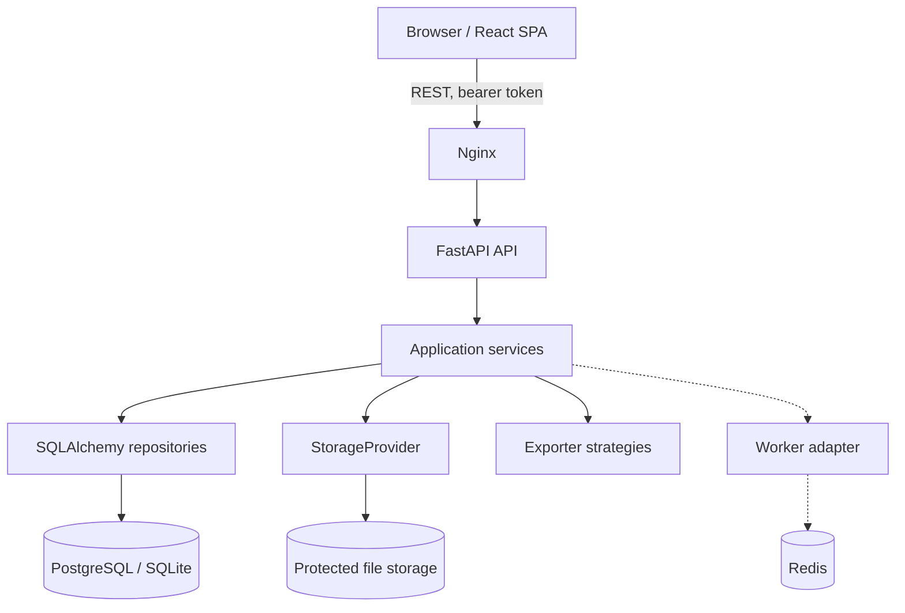

# 시스템 아키텍처

API router, service, repository, ORM/API schema를 분리합니다. 모든 권한 판정은 서비스 경계에서도 다시 수행합니다. 영상은 storage key만 DB에 기록하며 클라이언트에 서버 파일 경로를 노출하지 않습니다.

Viewer transform은 화면 행렬로만 적용되고 Annotation은 역변환을 통해 항상 `source_pixel` 좌표로 저장합니다. 저장할 때 Annotation 전체 상태의 불변 snapshot을 새 버전으로 기록합니다.

## 주요 설계 결정

- UUID 식별자로 순차 ID 추측을 줄입니다.
- PBKDF2-SHA256 비밀번호 해시와 만료되는 서명 토큰을 사용합니다.
- 원본 업로드는 checksum 기반 별도 파일로 보존하며 DICOM을 직접 수정하지 않습니다.
- task-level pessimistic lease와 aggregate optimistic version을 함께 사용합니다.
- 승인본 변경은 기존 snapshot을 삭제하지 않고 새 버전과 audit event를 만듭니다.
