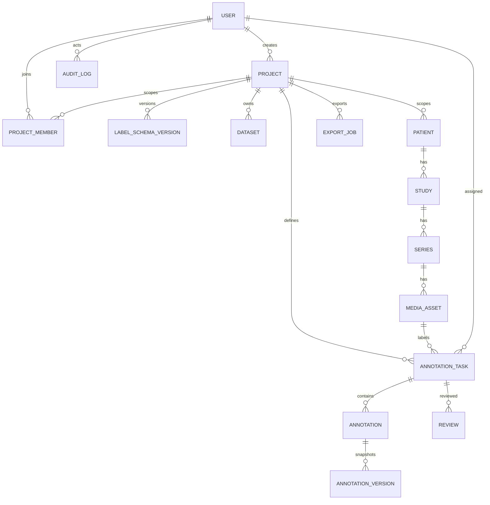

# 데이터베이스 ERD

```mermaid
erDiagram
  USER ||--o{ PROJECT : creates
  USER ||--o{ PROJECT_MEMBER : joins
  PROJECT ||--o{ PROJECT_MEMBER : scopes
  PROJECT ||--o{ LABEL_SCHEMA_VERSION : versions
  PROJECT ||--o{ DATASET : owns
  PROJECT ||--o{ PATIENT : scopes
  PATIENT ||--o{ STUDY : has
  STUDY ||--o{ SERIES : has
  SERIES ||--o{ MEDIA_ASSET : has
  PROJECT ||--o{ ANNOTATION_TASK : defines
  MEDIA_ASSET ||--o{ ANNOTATION_TASK : labels
  USER ||--o{ ANNOTATION_TASK : assigned
  ANNOTATION_TASK ||--o{ ANNOTATION : contains
  ANNOTATION ||--o{ ANNOTATION_VERSION : snapshots
  ANNOTATION_TASK ||--o{ REVIEW : reviewed
  USER ||--o{ AUDIT_LOG : acts
  PROJECT ||--o{ EXPORT_JOB : exports
```

세부 컬럼과 인덱스는 `backend/app/models/entities.py` 및 Alembic migration을 기준으로 합니다.
